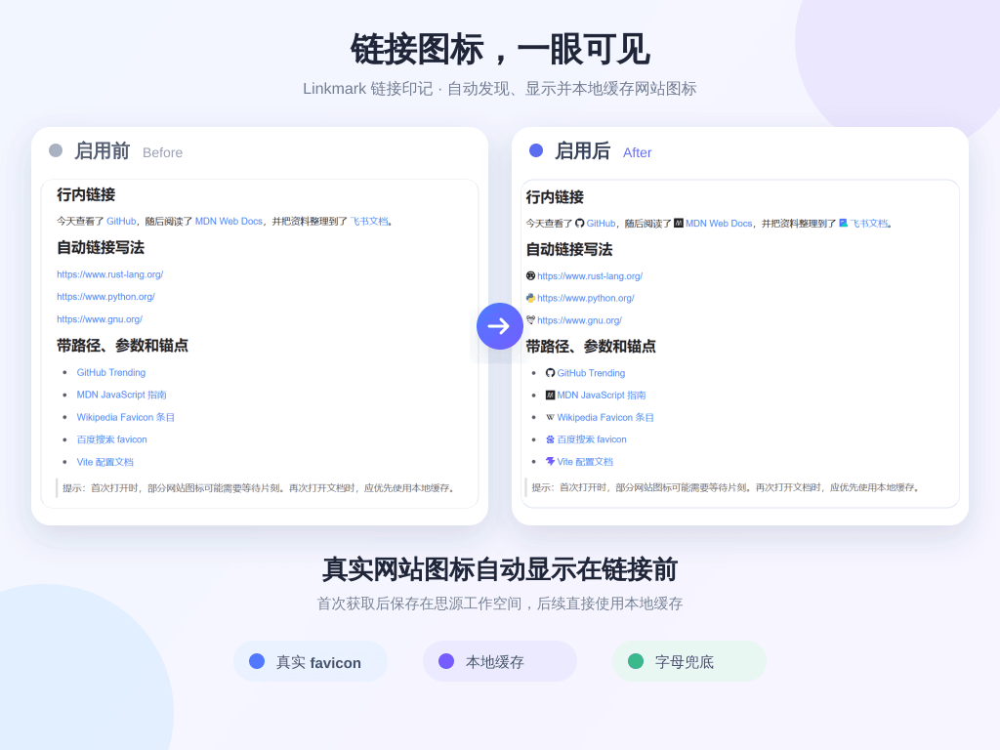

[English](README.md) | [简体中文](README.zh-CN.md)

# Linkmark

Linkmark automatically discovers, displays, and locally caches website icons for SiYuan links. When no usable favicon is available, it can generate a colorful domain monogram locally.

## Credits & Acknowledgements

Linkmark is an independent fork of [Acetab/auto-favicon](https://github.com/Acetab/auto-favicon). Linkmark and its maintainer are not affiliated with, sponsored by, or endorsed by Acetab or the upstream project.

The idea of displaying icons before links was separately inspired by [Link Icon](https://github.com/chenshinshi/link-icon). Linkmark does not bundle or redistribute code, icons, or other assets from Link Icon. See [Third-party notices](THIRD_PARTY_NOTICES.md) for trademark and platform-icon details.

Copyright is retained by Acetab and 霞葉 (Kasuha). Linkmark is available under the [MIT License](LICENSE).

## Fork and key differences

Linkmark is maintained independently from its upstream project. Its core user-visible differences are:

- **Independent icon rendering:** Linkmark does not detect, preserve, or prioritize icons from other plugins; it renders its own selected icon independently.
- **Shared workspace cache:** SiYuan's kernel owns icon retrieval, cache policy, and cache management, which are shared by every client connected to the same workspace.

## Features

- By default, discover icons from domain root pages, common root icon files (`/favicon.svg`, `/favicon.png`, `/apple-touch-icon.png`, and `/favicon.ico`), web manifests, and optional services without visiting paths that contain document IDs.
- Recognize stable route types for Tencent Docs, Feishu/Lark, and Google Docs, plus public NoCode app deployment routes, so different sites or content types on one domain can use different icons.
- Choose Standard Network, Proxy Network, or Direct Website Only.
- Cache verified icons in the SiYuan workspace and reuse them without external requests.
- Customize fallback monogram colors, letters, and shapes globally or per domain.
- Upload a custom icon, use an image URL, or choose from discovered candidates for a domain, with optional reuse across its subdomains.
- Use the top-bar menu to refresh the current document, manage cache, or open settings.
- Pause background retrieval, or explicitly allow specific-page discovery globally or once from the candidate picker.

## Features and what they are for

| Feature | Purpose |
| --- | --- |
| Automatically display website icons | Scan HTTP/HTTPS links in SiYuan documents and display an icon before each link. Disabling it stops display and automatic processing without deleting the cache. |
| Route-type icons | Classify only the stable route types of supported platforms such as Tencent Docs, Feishu/Lark, Google Docs, and NoCode, allowing different sites or content types on one domain to use different icons. Ordinary websites remain domain-scoped. |
| Pause automatic retrieval | Prevent background network access and automatic rebuilding while testing or organizing the cache. Existing and expired entries remain visible, while manual refresh, replacement, and upload actions still work. |
| Allow specific-page discovery | Off by default. Enable it only when a site declares different favicons for individual pages; requests go only to the original site and omit query parameters and fragments. |
| Load page-specific candidates | Grant access to the current page for one candidate-loading action without changing the global setting. |
| Retrieval strategy | Standard Network balances availability and coverage; Proxy Network adds Google and DuckDuckGo; Direct Website Only does not use third-party favicon services. |
| Third-party favicon service | Query FaviconKit, favicon.im, or another selected service by domain when the website has no usable icon. Document paths, titles, and tokens are never sent. |
| Local colorful monogram fallback | Generate a stable domain-letter icon locally after every real-icon source fails, so the link is not left without a visual marker. |
| Monogram appearance | Adjust fallback colors, text, and shape globally or for individual domains without changing real favicons. |
| Icon size | Change the icon size relative to surrounding text without modifying the cached image. |
| Cache lifetime | Choose when automatic icons should be checked again; `0` disables time-based expiration. Pinned icons do not expire. |
| Refresh current document / all cache | Explicitly retrieve the current document or all non-pinned entries again, including while automatic retrieval is paused. A failed refresh keeps the previous usable icon. |
| Cache management | View route types and sources grouped by domain, then refresh, delete, or replace individual entries. This is useful for blurry, padded, bordered, or otherwise unsuitable icons. |
| Pinned-icon scope | Current Type affects only matching routes such as `/doc/` or `/sheet/`; Current Domain covers types without their own pinned icon; Parent Domain and Subdomains lets tenant subdomains share one icon. |

## Icon selection priority

The plugin first looks for local pinned entries and cache records. It performs network resolution only when no usable local entry exists. Priority is highest to lowest:

1. Pinned icon for the current route type, such as `docs.qq.com::sheet`.
2. Pinned icon for the current domain.
3. Pinned parent-domain icon marked for use by all subdomains.
4. Valid cache for the current route type.
5. Valid cache for the current domain, also used as a temporary fallback before a type cache is created.
6. Locally recognized office-platform type icon.
7. The current domain root page's `rel=icon`, web app manifest icons, and common root icon files.
8. The valid parent domain's page declarations, manifest, and common root icon files.
9. Third-party favicon results for the current domain.
10. Third-party favicon results for the parent domain.
11. A locally generated colorful domain monogram.

When **Allow specific-page discovery** is enabled or **Load page-specific candidates** is clicked, the page's own `rel=icon` and manifest icons are inserted before item 6. This authorization does not override pinned icons or an existing usable cache.

## Cache behavior

Opening a document scans its web links, but a fresh cached icon is loaded locally and is not downloaded again. New, expired, missing, damaged, or manually refreshed entries are retrieved using the selected network strategy.

- Default lifetime: 30 days.
- Enter `0` to keep icons until they are manually cleared.
- Generated monograms follow the same lifetime.
- Failed domains are paused for 10 minutes during the current plugin session.
- A failed manual refresh keeps the previous working icon.
- Manually selected icons are pinned locally until automatic retrieval is restored; normal cache clearing and expiration do not remove them.
- Icon payloads and the `favicon-cache-v2.json` index are stored in Linkmark's private plugin storage. Normal entries retain only the domain; adapted-platform entries may also retain stable routes such as `doc`, `sheet`, `base`, or a public NoCode deployment identifier, never query parameters, fragments, or titles.
- Linkmark does not import or delete settings, cache entries, or pinned icons from the previous `auto-favicon` plugin.
- While automatic retrieval is paused, existing and expired entries remain visible and deleted entries are not rebuilt; manual refresh, candidate selection, and uploads remain available.

Cache management supports refreshing the current document, refreshing every automatically cached domain, searching cached domains, and refreshing or deleting a single domain.

## When an icon does not look right

A website may publish several icons whose sharpness, padding, and borders vary by source. If an automatically retrieved icon is blurry, bordered, or otherwise unsuitable, open **Manage cache** from the top toolbar, find the domain, and select **Change icon**:

- Choose from privacy-safe candidates; each card shows its source, pixel dimensions, format, and file size.
- Specific pages are not visited by default. Use **Load page-specific candidates** for one-time explicit discovery.
- Upload a local image.
- Enter a directly accessible image URL.

A manually selected icon is pinned locally and is not replaced by normal refreshes, cache expiration, or **Clear all cache**. Office-platform icons can be pinned to the current route type, the whole domain, or a parent domain and its subdomains. Select **Restore automatic retrieval** when you want the plugin to choose again.

## Network and privacy

- **Standard Network:** Current and valid parent domains plus the selected favicon service; no Google or DuckDuckGo requests.
- **Proxy Network:** Adds Google and DuckDuckGo for maximum coverage.
- **Direct Website Only:** Contacts only current and valid parent domains, then uses a local fallback if needed.

Automatic retrieval does not visit paths containing document IDs by default. Platform types are classified locally; to distinguish public NoCode deployments hosted on one domain, the plugin visits that app's deployment entry. Third-party services receive only the domain. Other paths are sent to the original site only when **Allow specific-page discovery** is enabled or the user clicks **Load page-specific candidates**. All path requests omit query parameters, fragments, Cookie, Authorization, and Referer headers, and icons from authentication redirects are discarded.

Localhost, `.local`, loopback, link-local, and private IP addresses are not sent to favicon services. Third-party services never receive note content, anchor text, document paths, or tokens.

## Install and use

Search for **Linkmark** in the SiYuan Marketplace and install it, or extract `package.zip` into `workspace/data/plugins/siyuan-linkmark/`. Enable the plugin, choose a network strategy in its settings, then use the Linkmark button in the top toolbar for common actions.

## Feedback

Report bugs and feature requests through the new repository's [GitHub Issues](https://github.com/kasuha07/siyuan-linkmark/issues).

When reporting a problem, please include the Linkmark and SiYuan versions, operating system, affected public URL, network strategy, favicon provider and fallback setting, and any relevant `[siyuan-linkmark] Unable to cache` console error. Remove private URLs, note content, tokens, and local paths before posting.

## Recent updates

### Linkmark 0.1.0

- Establish the independent Linkmark identity, repository, package namespace, and release line.
- Discover, display, and locally cache website icons while preserving pinned icons and privacy-focused network controls.

See [GitHub Releases](https://github.com/kasuha07/siyuan-linkmark/releases) for the complete version history.
